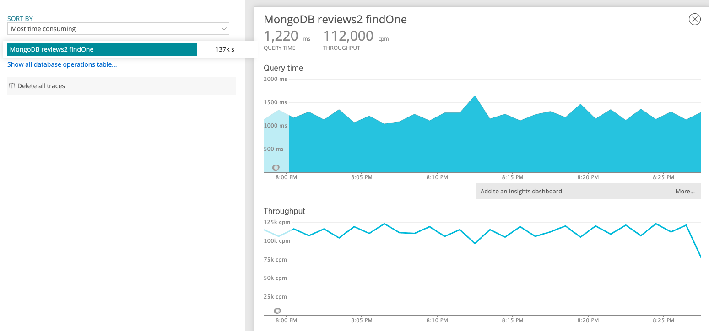

# Reviews_Edwards
<h2>System design Capstone</h2>

<h5>This was a project to push the potential of server performance</h5>
  
The goal of this project was to build out a server and a pair databases then test them for performance.  We had to choose both a SQL and noSQL database then choose one to focus on after with built them out.  I chose Postgres and Mongo DB for my two databases and then eventually narrowed it down to Mongo DB for benchmarking.  The requirements for the course were to meet the criteria below at a bare minimum.

  * Server response time under 2000ms under load

  * All queries needed to be executed in under 50ms

  * We had to generate and seed our databases with at least 10m documents

  * Error rate had to remain under 1% under load

  * Throughput needed to exceed 100rps under load

Below are some benchmarks achieved through the use of a single AWS t2.micro instance

Technology: 
  Mongo DB, Mongoose, Postgresql, PgAdmin4
  Express, Node, 
  K6, New Relic

